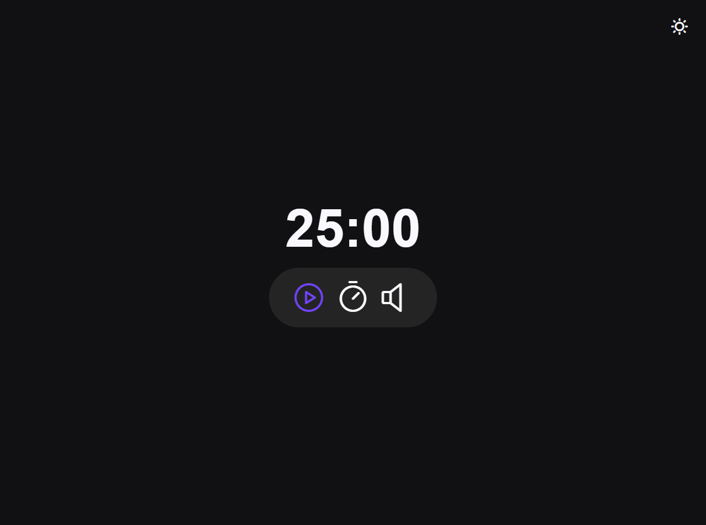

# Aplicativo Focus Timer V2.0

> Trilha Explorer

Aplicativo Focus Timer desenvolvido com JS para melhorar o seu foco e tempo gasto em suas atividades utilizando o metodo pomodoro, agora com a possibilidade de alternar entre o tema claro e escuro.

[Clique aqui para acessar](https://pedro-k.github.io/focus_timer_2.0/)

## Tecnologias

- HTML
- CSS
- JavaScript
- Git e Github

pedro.kleinfelder@hotmail.com